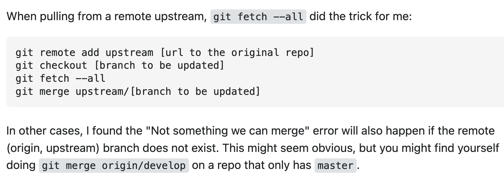

# **Web Development Notes**
1.choose colors for background from website : [colorhunt](https://colorhunt.co)

2.[markdown cheatsheet](https://www.markdownguide.org/cheat-sheet/)

3.MDN for web development attributes search : [MDN](https://developer.mozilla.org/en-US/)

4.css rule: in line css > internal css > external css

5.css syntax: selector{property:value;}

6.css class: exmaple: img{class="name"}

7.useful git trick

8.find fonts at Google Fonts.

9.find free icons from : [flaticom](https://flaticons.net/free-icons)
  find free animated image : [GIPHY](https://giphy.com/)
  find free image from : [Free Image!](https://pixabay.com/)
  find css button : [Configure Button](https://css3buttongenerator.com/)
  User Interface Design patterns: [UI](https://ui-patterns.com/)
  Design Inspiration: [UI-UI](https://dribbble.com/tags/ui)
  Design On Papers(build from scratch): [sneakpeekit](https://sneakpeekit.com/)
